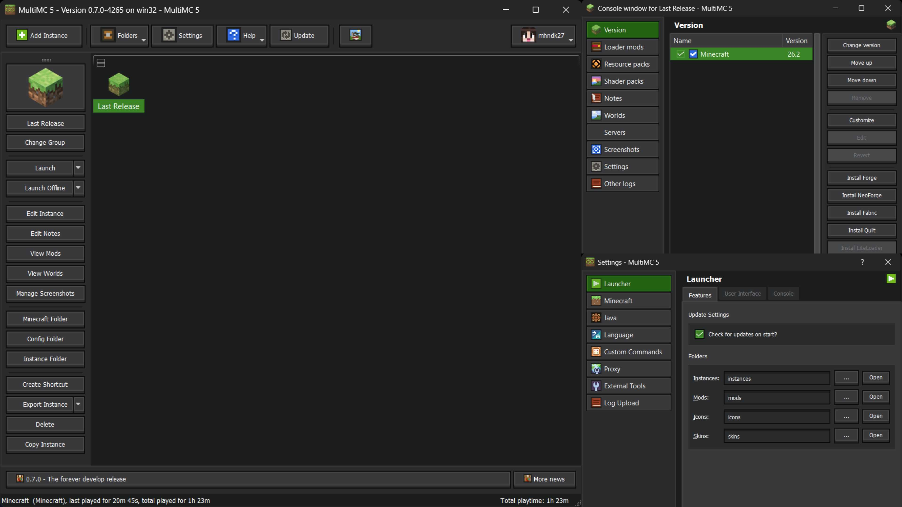
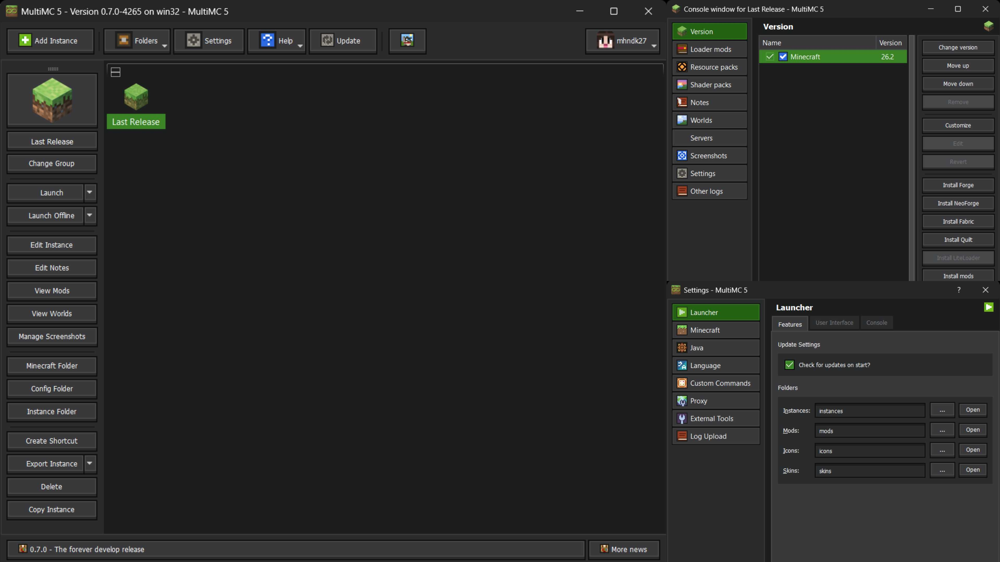
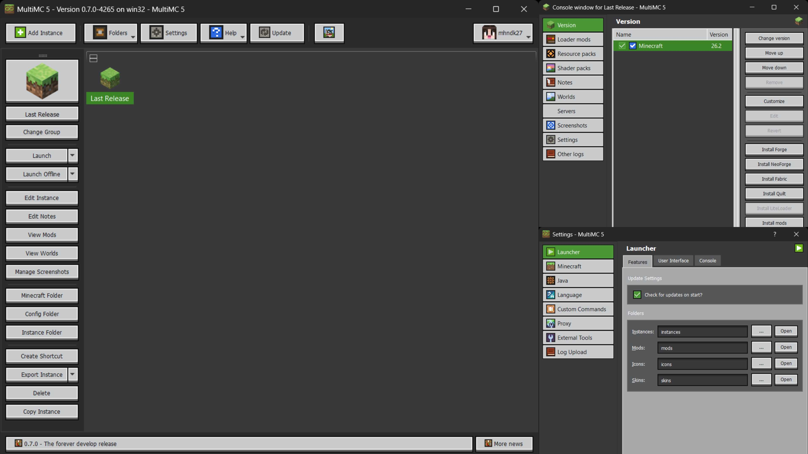
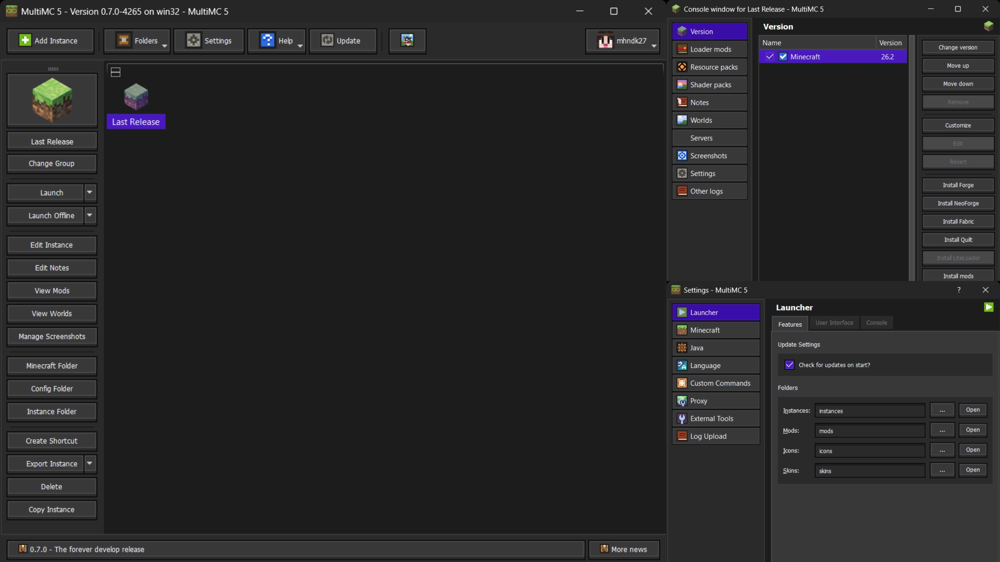
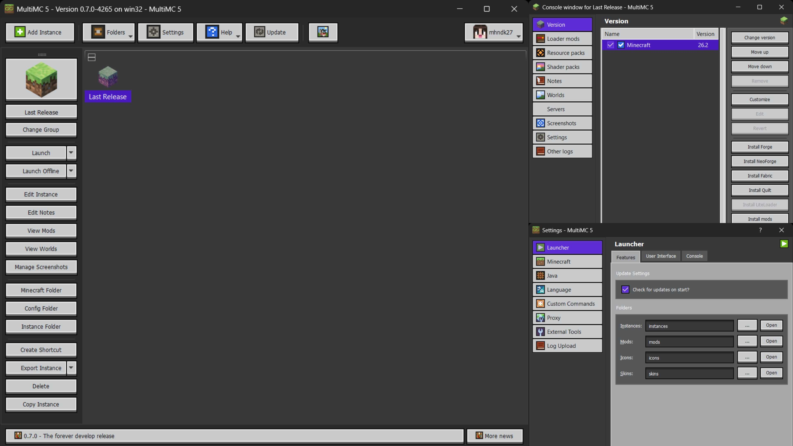
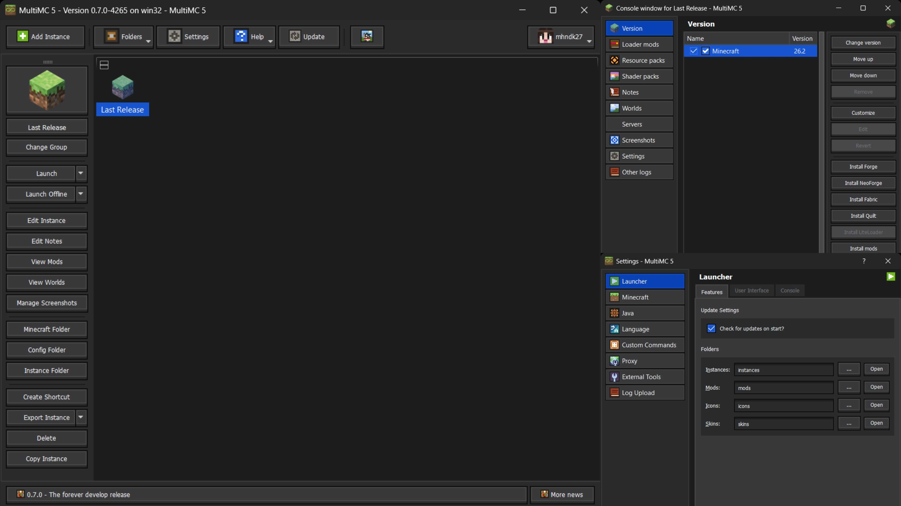
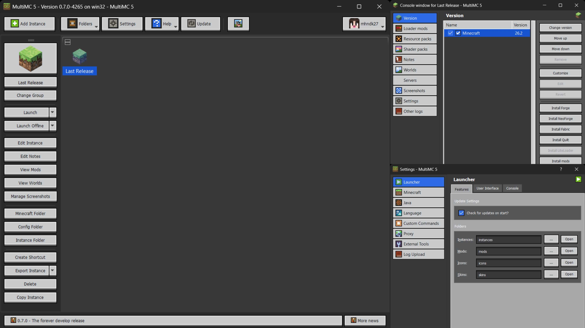

# Ore UI for MultiMC

**A Minecraft Bedrock–inspired theme, ported from Prism Launcher to [MultiMC](https://multimc.org/).**

---

## Preview

| Dark | Light |
|---|---|
|  |  |
|  |  |
|  |  |

---

## About

[**Ore UI**](https://github.com/ninsent/Ore-UI-theme-pack) is a Minecraft Bedrock–inspired theme originally built for **Prism Launcher** by [Nursultan Akim (@ninsent)](https://github.com/ninsent), with an icon pack by [@maksiuuuuu](https://github.com/maksiuuuuu).

This repository is an independent **port to MultiMC**. MultiMC's theme engine is older and reads a different format than Prism's, so the original files don't work as-is — this project adapts them while keeping the original visual design intact. The technical differences are documented in [CHANGES.md](CHANGES.md).

This is an unofficial, community-made port. It is not affiliated with or endorsed by Mojang, the MultiMC team, or Prism Launcher.

---

## Variants

| | Emerald | Amethyst | Diamond |
|---|:---:|:---:|:---:|
| **Dark** — dark chrome, dark buttons | ✅ | ✅ | ✅ |
| **Light** — dark chrome, light buttons | ✅ | ✅ | ✅ |

A matching icon theme and a set of replacement instance/version icons are also included.

---

## Installation

Download what you need from the **[Releases page](../../releases)** — three separate packs:

| Pack | Contains |
|---|---|
| **Ore UI (MultiMC port) – Themes Pack** | All 6 color variants, ready to drop into `themes/` |
| **Ore UI – Icon Pack** | The program icon theme, ready to drop into `iconthemes/` |
| **Ore UI – Instance Icons Pack** | Replacement instance/version icons, ready to drop into `icons/` |

See **[INSTALL.md](INSTALL.md)** for step-by-step instructions for each pack.

---

## Credits

| Role | Author |
|---|---|
| Original Ore UI theme (Prism Launcher) | [Nursultan Akim — @ninsent](https://github.com/ninsent) |
| Icon pack | [@maksiuuuuu](https://github.com/maksiuuuuu) |
| Icon theme packaging (`index.theme`) | LOLCATpl |
| MultiMC port & fixes | [mhndk27](https://github.com/mhndk27) |

---

## License

MIT — see [`LICENSE`](LICENSE). Each theme's `resources/` folder includes its own `LICENSE` covering the SVG assets inside it.
